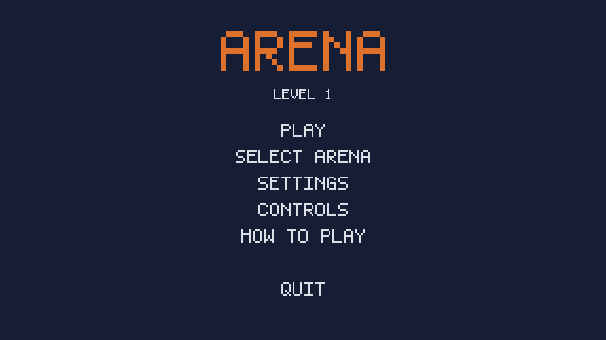
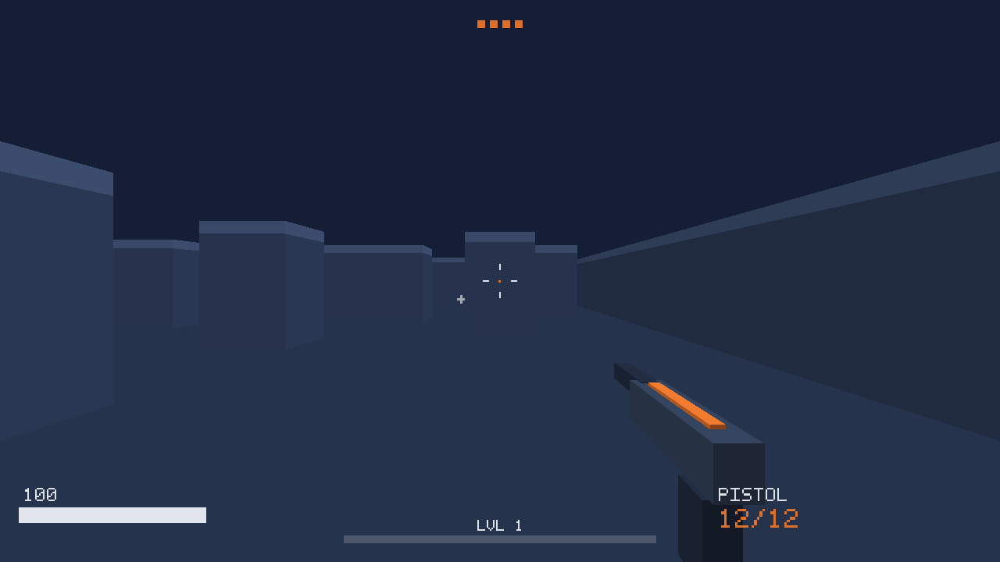

# arena

A first-person arena shooter built from scratch in C++17 with SDL2 and
OpenGL 3.3 core profile. No game engine — rendering, physics, collision,
AI, audio, UI, and progression are all hand-written.




## Features

### Combat
- **7 unlockable weapons** — pistol, SMG, shotgun, rifle, DMR, piercing
  railgun, and minigun, each with its own fire rate, magazine, spread,
  damage, and ADS zoom, defined in a data-driven table
- **Aim down sights** — right-click smoothly zooms FOV, tightens spread,
  and pulls the weapon to center
- **Melee** — close-range cone attack on a rebindable key
- **Ranged enemy AI** — wander/chase/dying state machine; enemies close
  distance, strafe at mid-range, fire dodgeable line-of-sight-checked
  projectiles, melee on contact, separate from each other so they surround
  rather than stack, and crumple on death
- **Wave system** — clear the arena to advance; each wave adds an enemy

### Progression (saved between sessions)
- **XP and 50 levels** — kills grant XP; leveling unlocks weapons and arenas
- **Prestige** — at level 50, reset to level 1 for a prestige rank (I–V),
  each granting a distinct glowing particle aura on your weapon
- All progress and settings persist to `arena_profile.txt`

### Game feel
- Procedurally synthesized audio (no asset files) — distinct sounds for
  each weapon, hits, pickups, level-ups, melee, and damage
- Muzzle flash, recoil, screen shake, hit sparks, damage vignette
- Health pickups that spin, bob, and respawn on a timer

### Interface
- **Hand-built 5x7 bitmap font** rendered as quads — no texture assets
- Main menu, pause menu, settings (sensitivity / volume / fullscreen),
  rebindable controls, how-to-play, arena select, and death screen
- Live HUD: health, weapon, ammo, XP bar, wave ticks, level/prestige

### Arenas
- 3 procedurally generated layouts (Courtyard, Foundry, Citadel) with
  distinct density and color grading, unlocked by level

## Controls (all rebindable)

| Input | Action |
|---|---|
| W A S D | Move |
| Mouse | Look |
| Left click | Shoot |
| Right click | Aim down sights |
| F | Melee |
| R | Reload |
| Q / E | Swap weapon |
| Space | Jump |
| Esc | Pause / back |

## Building

**Linux**
```bash
sudo apt install libsdl2-dev libglew-dev libglm-dev cmake g++
cmake -B build -DCMAKE_BUILD_TYPE=Release && cmake --build build
./build/arena
```

**macOS**
```bash
brew install sdl2 glew glm cmake
cmake -B build -DCMAKE_BUILD_TYPE=Release && cmake --build build
./build/arena
```

**Windows (MSYS2 MinGW64)**
```bash
pacman -S mingw-w64-x86_64-{gcc,cmake,SDL2,glew,glm}
cmake -B build -G "MinGW Makefiles" -DCMAKE_BUILD_TYPE=Release
cmake --build build
./build/arena.exe
```

## Architecture

```
src/
  shaders.h       GLSL world + HUD shaders, compile/link helpers
  font.h          embedded 5x7 bitmap font
  audio.h         procedural SFX synthesis + lock-protected mixer
  level.h         AABB, ray/overlap tests, procedural arena generation
  entities.h      player (with air control), enemy AI + separation,
                  projectiles, pickups
  progression.h   weapon/arena tables, settings, keybinds, XP/prestige,
                  save-load
  main.cpp        SDL/GL setup, screens, renderer, game loop
```

Design notes:

- **One cube mesh** is transformed per draw call for every solid in the
  game — walls, enemies, pickups, particles, weapon, and font pixels.
- **Per-axis collision** gives free wall-sliding; **air control**
  blends momentum toward input so you can strafe mid-jump.
- **Boids-style separation** spreads enemies around the player.
- **Everything procedural** — geometry, audio, and font are generated in
  code, so the repo ships with zero binary assets.

## Roadmap
- Textured surfaces and normal mapping
- A* enemy pathfinding around walls
- More enemy types (ranged snipers, chargers)
- Controller support
